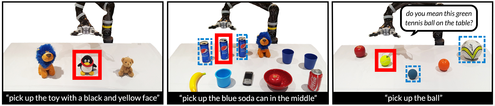

# INGRESS

[**Interactive Visual Grounding of Referring Expressions for Human Robot Interaction**](http://www.roboticsproceedings.org/rss14/p28.pdf)  
Mohit Shridhar, David Hsu  
RSS 2018



Since my code is an **abomination**, I created a docker image (~9.2GB) of my setup. You can treat this is as a black box; input: image & expression, output: bounding boxes and question captions  

If you find the code useful, please cite:

```
@inproceedings{Shridhar-RSS-18, 
    author    = {Mohit Shridhar AND David Hsu}, 
    title     = {Interactive Visual Grounding of Referring Expressions for Human-Robot Interaction}, 
    booktitle = {Proceedings of Robotics: Science and Systems}, 
    year      = {2018}
} 
```

## Requirements

#### Software
- [Ubuntu 14.04](http://releases.ubuntu.com/14.04/)
- [Docker 18.03.1+](https://docs.docker.com/install/linux/docker-ce/ubuntu/#install-docker-ce)
- [NVIDIA Docker](https://github.com/nvidia/nvidia-docker/wiki/Installation-(version-2.0))
- [ROS Indigo](http://wiki.ros.org/indigo/Installation/Ubuntu)
- [OpenCV 2](https://docs.opencv.org/3.4.1/d2/de6/tutorial_py_setup_in_ubuntu.html) (Optional)

#### Hardware
- Tested on NVIDIA GTX 1080 (needs about 2.5 GB RAM)
	

## Installation

The docker image contains: ROS (Indigo), Torch, Caffe, and Ingress (source code). To run and test Ingress inside the docker image, you don't need to install any dependencies other than nvidia-docker itself. However, for a server-client setup, you need to clone this repo on both the server & client, and compile the interface on the client side (see below). The client can also be the shell running the docker image.   

#### Docker (server)

Follow the instructions to install NVIDIA docker. You should be able to run this, if everything is installed properly:
```bash
$ docker run --runtime=nvidia --rm nvidia/cuda nvidia-smi
```

#### Interface (client)

Clone the repo:
```bash
$ cd <ros_workspace>/src
$ git clone --recursive https://github.com/AdaCompNUS/ingress.git
```

Install actionlib messages:
```bash
$ cd <ros_workspace>
$ catkin_make --pkg action_controller
```

## Usage

#### ROS Setup

Start roscore:
```bash
$ roscore
```

#### Network Setup (Optional)

For a server-client setup, edit the `start_ingress.sh` script with your network settings:
```bash
...
MASTER_URI=http://<roscore_ip_addr>:11311
IP=<system_ip_addr>
...
```

#### Launch

Run the script. The first time you run this command, Docker downloads an 9.2GB image (could take a while!)  
```bash
$ sh start_ingress.sh
```

Start the INGRESS server by running the `ingress` command:
```bash
root@pc:/# ingress
```

Wait until you see `METEOR initialized`. That means, the grounding server is ready.

#### Exit

To shutdown the `ingress` server, use `Ctrl + c` or `Ctrl + \`.

## Options

#### Disambiguation

By default, the disambiguation is enabled. It can disabled by setting `DISAMBIGUATE=false` in `~/ingress_server.sh` for fast-grounding without disambiguation:

```bash
root@pc:/# sed -i 's/DISAMBIGUATE=true/DISAMBIGUATE=false/g' ~/ingress_server.sh
root@pc:/# ingress
```

## Example

After starting the `ingress` server, try out the example:

#### From docker image

```bash
root@pc:/# cd ~/ros_devel_ws/src/ingress/examples/
root@pc:/# python interactive_grounding_example.py
```

OR

#### From client PC

```bash
$ cd <ros_workspace>/examples
$ python interactive_grounding_example.py
```

Type "the red cup in the middle" into the query. This outputs `grounding_result.png` and prints out self-referrential and relational captions.


## Tips

- Use [tmux](http://manpages.ubuntu.com/manpages/xenial/man1/tmux.1.html) to multiplex `roscore`, `ingress` and `python interactive_grounding_example.py`
- Make sure the input image is well-lit, and the scene is uncluttered

## Development

Good luck...


