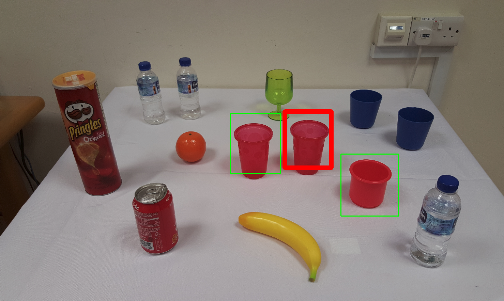

# INGRESS

[**Interactive Visual Grounding of Referring Expressions for Human Robot Interaction**](http://www.roboticsproceedings.org/rss14/p28.pdf)  
Mohit Shridhar, David Hsu  
RSS 2018


This is a docker image (~9.2GB) of my setup for grounding referring expressions. You can treat this is as a black box; input: image & expression, output: bounding boxes and question captions. See [Architecture](docs/arch.md) for more details.  

If you find the code useful, please cite:

```
@inproceedings{Shridhar-RSS-18, 
    author    = {Mohit Shridhar AND David Hsu}, 
    title     = {Interactive Visual Grounding of Referring Expressions for Human-Robot Interaction}, 
    booktitle = {Proceedings of Robotics: Science and Systems}, 
    year      = {2018}
} 
```

## Requirements

#### Software
- [Ubuntu 14.04](http://releases.ubuntu.com/14.04/)
- [Docker 18.03.1+](https://docs.docker.com/install/linux/docker-ce/ubuntu/#install-docker-ce)
- [NVIDIA Docker](https://github.com/NVIDIA/nvidia-docker)
- [ROS Indigo](http://wiki.ros.org/indigo/Installation/Ubuntu) 
- [OpenCV 2](https://docs.opencv.org/3.4.1/d2/de6/tutorial_py_setup_in_ubuntu.html) (Optional)

#### Hardware
- Tested on NVIDIA GTX 1080 (needs about 2.5 GB RAM)
	

## Installation

The docker image contains: [ROS (Indigo)](http://wiki.ros.org/indigo), [Torch](http://torch.ch/), [Caffe](http://caffe.berkeleyvision.org/), and Ingress (source code). To run and test Ingress inside the docker image, you don't need to install any dependencies other than nvidia-docker itself.

<!--However, for a server-client setup, you need to clone this repo on both the server & client, and compile the interface on the client side (see below). The client can also be the shell running the docker image.-->   

#### Nvidia Docker 

Follow the instructions to [install NVIDIA docker](https://github.com/NVIDIA/nvidia-docker). You should be able to run this, if everything is installed properly:
```bash
$ docker run --runtime=nvidia --rm nvidia/cuda nvidia-smi
```


## Quickstart

A quick guide to testing the whole system inside the docker image.  

#### Script

**Clone** the repo OR **unzip** the folder:
```bash
$ git clone --recursive https://github.com/AdaCompNUS/ingress.git 
```

Run the script. The first time you run this command, Docker downloads an 9.2GB image (could take a while!):
```bash
$ cd <ingress_dir>
$ sh start_ingress.sh
```

#### Roscore

Start roscore in a tmux shell:
```bash
root@pc:/# tmux new -s roscore
root@pc:/# roscore
```

Press `Ctrl+b` and `d` to escape the tmux shell.  

#### Ingress

Start the INGRESS server in a tmux shell by running the `ingress` command:
```bash
root@pc:/# tmux new -s ingress
root@pc:/# ingress
```

Wait until you see `METEOR initialized`. That means the grounding server is ready. Now you can send images and expressions to the server, and receive grounded bounding boxes and question captions as output.  

#### Test

Run the example in another tmux shell:

```bash
root@pc:/# tmux new -s test
root@pc:/# cd ~/ros_devel_ws/src/ingress/examples/
root@pc:/# python interactive_grounding_example.py
```

Type "the red cup" into the query. This outputs `grounding_result.png` and prints out self-referrential and relational question captions:



```
[INFO] [WallTime: 1532576914.160205] Self Referential Captions:
['a red cup on the table', 'red cup on the table', 'red cup on the table']

[INFO] [WallTime: 1532576914.160599] Relational Captions:
['the red cup in the middle.', 'the red cup on the left.', 'the red cup on the right.']
```

To open `grounding_result.png`, on a separate shell:

```bash
$ docker cp <container_id>:/root/ros_devel_ws/src/ingress/examples/grounding_result.png ./
```

#### Exit

To shutdown the `ingress` server, use `Ctrl + c` or `Ctrl + \`.


## Server-Client Setup

To integrate Ingress with real-robots, use the docker image as a grounding server. But first, you need to compile the ROS actionlib interface on your robot or client-pc in order to communicate with the Ingress server (that is running inside the docker image).

#### Compile Interface 

On your robot/client-pc clone the repo:
```bash
$ cd <your_ros_workspace>/src
$ git clone https://github.com/MohitShridhar/action_controller.git
```

Install actionlib messages:
```bash
$ cd <your_ros_workspace>
$ catkin_make --pkg action_controller
```

#### Network Setup

Edit the `start_ingress.sh` script with your network settings:
```bash
...
MASTER_URI=http://<roscore_ip_addr>:11311
IP=<ingress_system_ip_addr>
...
```

#### Usage

Start `roscore` on your robot or client-pc. Then start `ingress` inside the docker image:

```bash
$ sh start_ingress.sh
root@pc:/# ingress
```

You should now be able to run the Quickstart example outside the docker image on all clients connected to the roscore.

## Options

#### Disambiguation

By default, the disambiguation is enabled. It can disabled by setting `DISAMBIGUATE=false` in `~/ingress_server.sh` for fast-grounding without disambiguation:

```bash
root@pc:/# sed -i 's/DISAMBIGUATE=true/DISAMBIGUATE=false/g' ~/ingress_server.sh
root@pc:/# ingress
```

## Tips

- `roscore` should be up and running before you start the `ingress` server
- Make sure the input image is well-lit, and the scene is uncluttered
- Use [tmux](http://manpages.ubuntu.com/manpages/xenial/man1/tmux.1.html) to multiplex `roscore`, `ingress` and `python interactive_grounding_example.py`

## Caveats

This demo code doesn't contain the interactive question asking interface.

## Issues

If Lua complains that certain CUDA functions were not found during execution. Reinstall the rocks and commit the changes to the docker image:

```bash
$ luarocks install cutorch
$ luarocks install cunn
$ luarocks install cudnn
```


