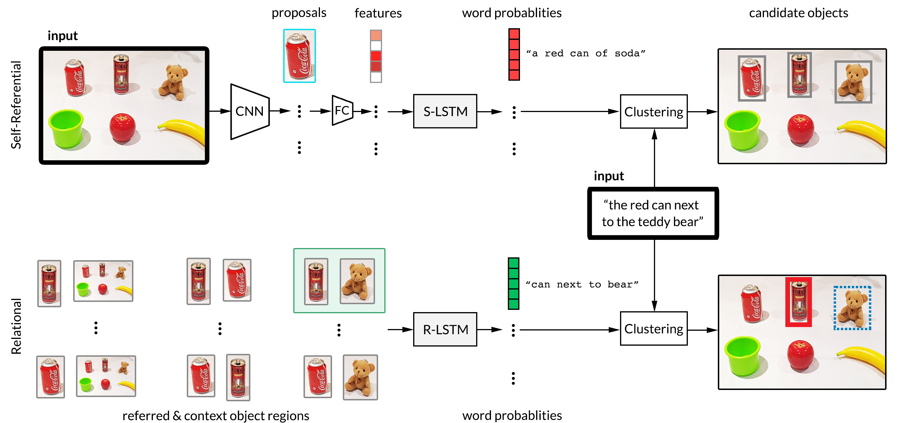

# Architecture

A brief overview of the architecture of Ingress. 

## System Overview

Ingress is composed of two main components. The components are connected through ROS [actionlib](http://wiki.ros.org/actionlib). The Self-Referrential module uses a pretrained [Densecap](https://github.com/jcjohnson/densecap) model to generated object proposals (bounding boxes), self-referrential captions, and grounding losses for a given self-referrential expression. The Relational module clusters out a set of relevant objects using the computed grounding losses and METEOR scores between the captions and the input expression. Finally, the module uses the feature vectors and bounding boxes to ground a pair of objects. For ambiguous scenarios, the generated self-referential and relational captions are used to ask questions.

## Model Overview

See the [paper](http://www.roboticsproceedings.org/rss14/p28.pdf) for more details.

## Acknowledgements

[Johnson et. al, Densecap](https://github.com/jcjohnson/densecap)  
[Nagaraja et. al, Referring Expressions](https://github.com/varun-nagaraja/referring-expressions)