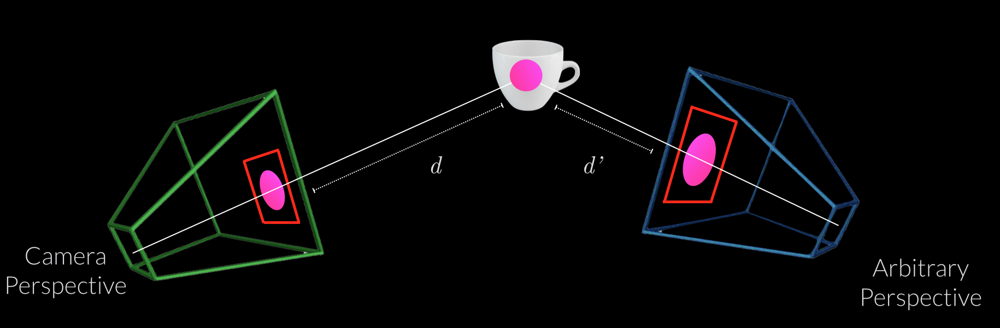
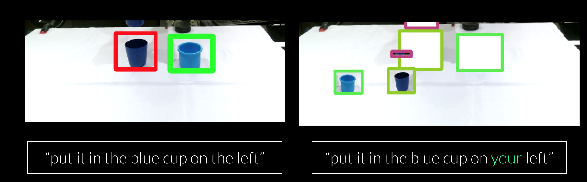

# Perspective Correction

For a set of known viewpoints, i.e. 6-DOF poses for 'my' and 'your', reproject the bounding boxes using the Kinect 3D centroid estimate:

The results should look something like this:

